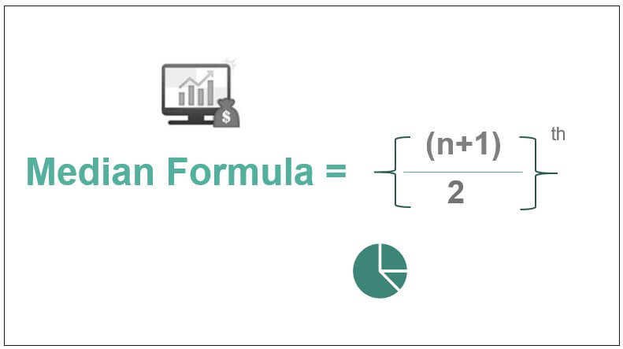
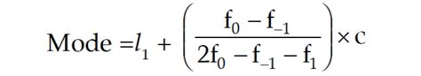

# Statistics

## **Classification and Tabulation**

- Textual Representation - Described In Paragraphs.
- Tabular Representation - Statistical Data.
- Statistical Data - Data presented in :
    - One-way Table
    - Two-way Table
    - Three-way Table

<aside>
💡 Definition of Frequency : The number of observations is called the frequency of that class

</aside>

## Equations

- Relative Frequency = f/N (f-Frequency of that Class, N- Total Frequency)
- % Relative Frequency = f/N*100 (f-Frequency of that Class, N- Total Frequency)
- Density Frequency = f/h (f-frequency of that class , h - class width)

# Central Tendency

<aside>
💡 **Mean:** The "average" number; found by adding all data points and dividing by the number of data points.

</aside>

<aside>
💡 **Median**: is the middle point in a dataset—half of the data points are smaller than the median and half of the data points are larger.

</aside>

<aside>
💡 M**ode:** is the most commonly occurring data point in a dataset.

</aside>

[Moments , Skewness and Kurtosis](Statistics/Moments%20,%20Skewness%20and%20Kurtosis%2027544a183ae74b2883ba263fff9c6fc1.md)

[Probability](Statistics/Probability%2076b0db07a8204c23b5f3af8509903522.md)

[Random Variables](Statistics/Random%20Variables%2061a93fe635634273b8036383054633b1.md)

[Correlation and Regression ](Statistics/Correlation%20and%20Regression%20107e5b27b4824a6aacb643c118aeb1ae.md)