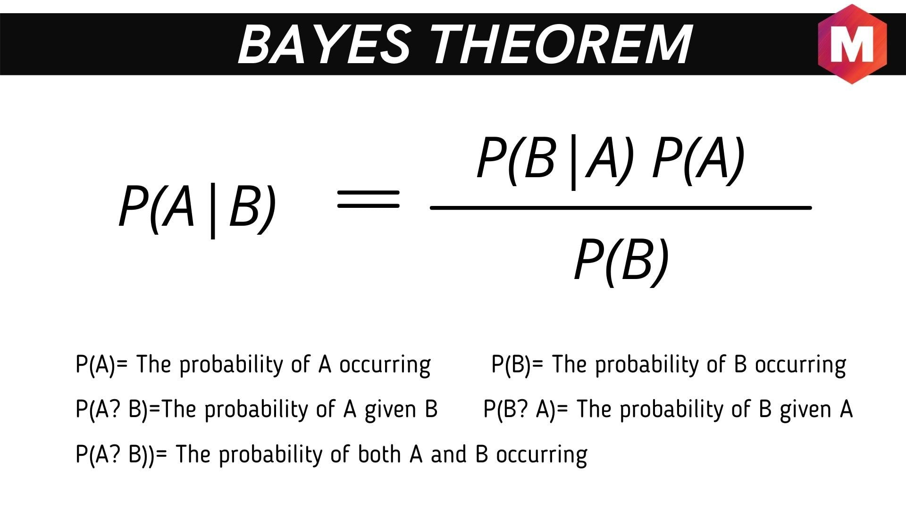

# Probability

- **Random Experiment**: An experiment in which the set of all possible outcomes are known, but the exact outcome is unknown.
- **Sample Space**: All the outcomes.
- **Exhaustive Outcome**: list of Possible outcomes.
- **Mutually Exclusive Outcomes**: one outcome prevents all the other outcomes.
- An subset of an sample space is called an **Event**

## Relative Frequency

- **Relative frequency** (Probability)= The number of ways the outcome can happen/Total Number of Outcomes.

### Equally Likely Approach

- Equal outcomes of Probability
    - e.g- if a fair coin is tossed hundred times 50-H 50-T

## Axioms of Probability

- Properties
    - P(A)≥0 for all A c S.
    - P(S)=1.
    
    - if A n B ≠ 0,
        - then P(A U B) = P(A) + P(B)

## Conditional Probability

- In [probability theory](https://en.wikipedia.org/wiki/Probability_theory), **conditional probability** is a measure of the [probability](https://en.wikipedia.org/wiki/Probability) of an [event](https://en.wikipedia.org/wiki/Event_(probability_theory)) occurring, given that another event (by assumption, presumption, assertion or evidence) has already occurred.
- Syntax : P(A|B)
- Formula = P(A|B)=P(A n B)/P(B)

## Multiplicative Law of Probability

### **P(A and B)=P(A)⋅P(B∣A)**

- Example
    
    [The general multiplication rule (article) | Khan Academy](https://www.khanacademy.org/math/ap-statistics/probability-ap/probability-multiplication-rule/a/general-multiplication-rule)
    

## Baye’s Theorem

Theorem:

## Concept of Independence

- In probability, we say two events are independent if knowing one event occurred doesn't change the probability of the other event.

## Counting Techniques

- Permutation and Combinations.
- Tree Diagram

###