# SkyTower: 1 Writeup

Description :

`Welcome to SkyTower:1`

`This CTF was designed by Telspace Systems for the CTF at the ITWeb Security Summit and BSidesCPT (Cape Town). The aim is to test intermediate to advanced security enthusiasts in their ability to attack a system using a multi-faceted approach and obtain the "flag".`

`You will require skills across different facets of system and application vulnerabilities, as well as an understanding of various services and how to attack them. Most of all, your logical thinking and methodical approach to penetration testing will come into play to allow you to successfully attack this system. Try different variations and approaches. You will most likely find that automated tools will not assist you.`

`We encourage you to try it our for yourself first, give yourself plenty of time and then only revert to the Walkthroughs below.`

`Enjoy!`

`Telspace Systems`

`@telspacesystems`

**Objective -**

SkyTower: 1 - [https://www.vulnhub.com/entry/skytower-1,96/](https://www.vulnhub.com/entry/skytower-1,96/)

### Writeup

- Download the `Skytower` VM from the above link and provision it as a VM.
- To find the IP of the machine, get both VMs (Home lab & SkyTower) on the same network.
- For the exact IP, i did an subnet scan on my own kali’s IP.
    
    `nmap -Pn -v <kali-IP>/24`
    
- Found the IP, now did a targeted nmap scan `nmap -sC -sV --v -p- <Target-IP> -oA results`
- `nmap_result` :
    
    [results.nmap](./SkyTower/results.nmap)
    
- Ports
    - 22 → Filtered
    - 80 → Open
    - 3128 → Open

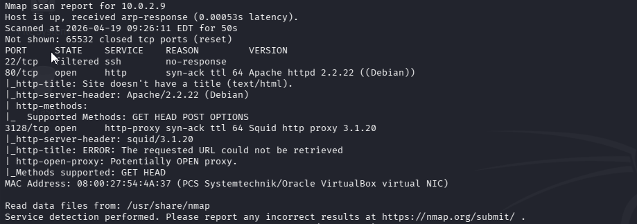

- Things to Note -
    - `SSH` is filtered not open
    - Potential Main Attack vector is port `80`
    - and there’s a proxy running on port `3128`

---

#### Exploring Web App

- When accessed website
    - Homepage :
    
    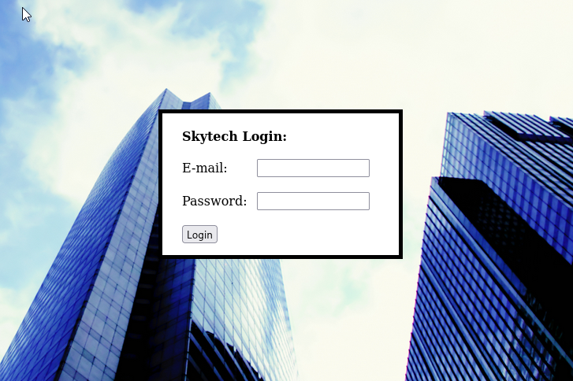
    
    - There’s a login page , no registration. So only way to move forward is auth attacks or finding potential creds somewhere.
    - My own personal methodology for a login page is to try SQL injection first, which usually gives further attack surface.
    - Did some basic payloads didn’t work like `' OR 1=1--` and got the error
        
        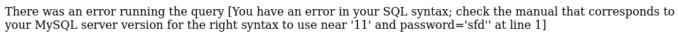
        
    - I started using some more advanced SQL injection. but looks like our “OR” is filtered out,
        
        Payload : `' || 1-1#`
        
    - This worked !
    - Redirection page gave some major information of the box
        
        
        
        - Found some `SSH` creds : `john:hereisjohn`

---

#### SSH Enumeration

- But port 22 SSH was filtered, so proxy had to be setup to access SSH
- For configuring Proxy, `proxychains`
- append `http <target-ip> 3128` to `/etc/proxychains4.conf`

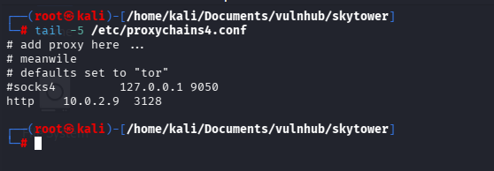

- Did further nmap testing to check if this worked, and it did work got `port 22` open.
    
    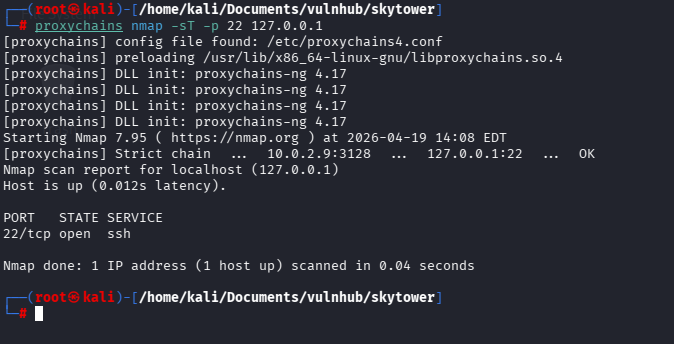
    
- To access SSH, `proxychains ssh john@127.0.0.1`

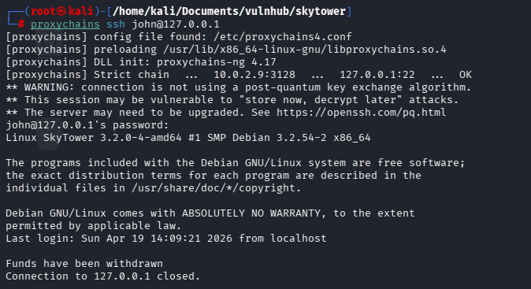

- But the connection closed instantly, there is no `tty` so to force this `ssh -t`  is used to force pseudo-terminal allocation.

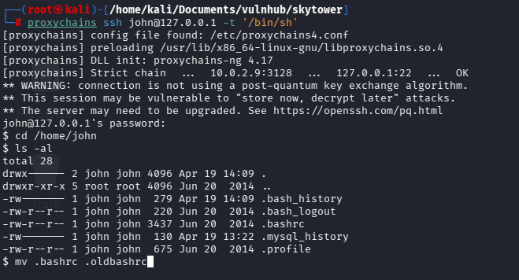

- This worked and to terminate the old configs moved the current `.bashrc` to `.oldbashrc` and login again this should work and get a stable shell.

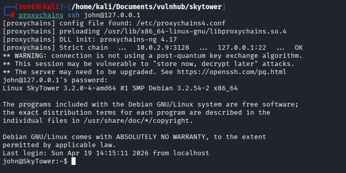

- Got a stable shell, now exploring the machine and found some creds in `/var/www/login.php`

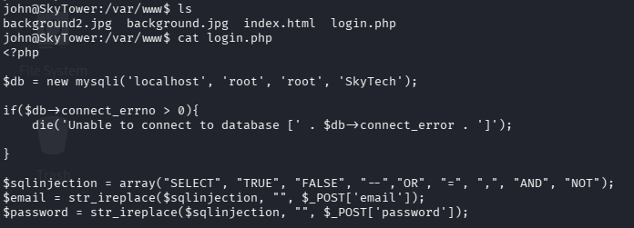

#### SQL enumeration

Creds - `root:root` 

commands -

`mysql -uroot -proot`

`show databases;`

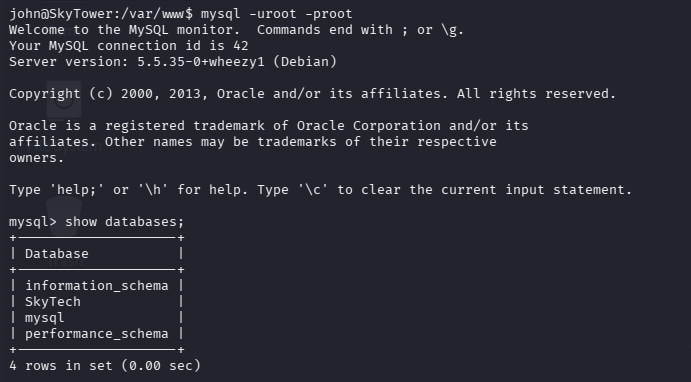

`use SkyTech;`

`show tables;`

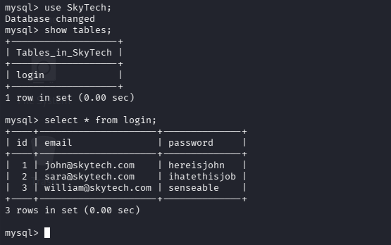

- Got the creds to all the users in the box.

---

### Privilege Escalation

- Got other users creds , so did some lateral privilege escalation.
- SSH into sara

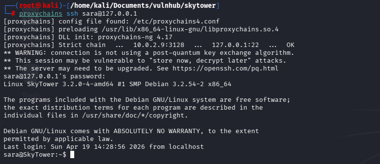

- I used `sudo -l` to check the sudo permissions and noticed that I had permission to run `cat /accounts/*`. I then decided to try a bit of path traversal so that I could view the contents of flag file.
- I used the command `sudo cat /accounts/root/flag`, which runs the command as a sudo user, but rather than choosing a file under accounts, it steps back one and goes into "/root/flag.txt". 
Running this command told me the root password!

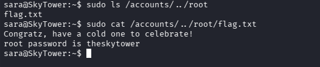

- Now for the final step `su root`  using the password got from the `/root/flag.txt`

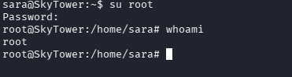

**The Box is now complete.**

